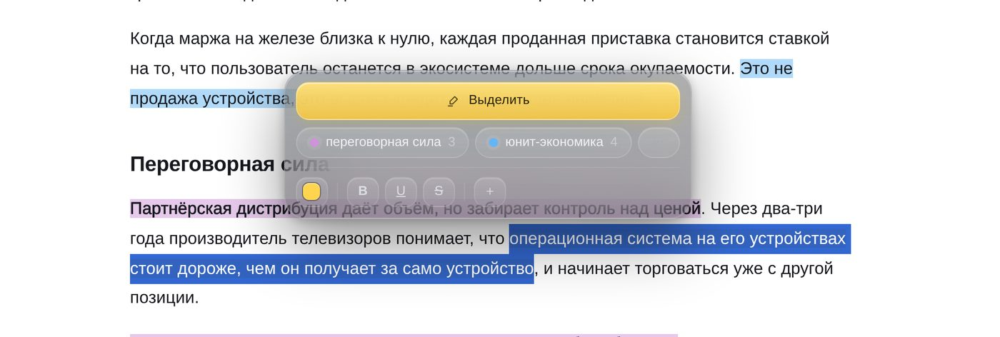
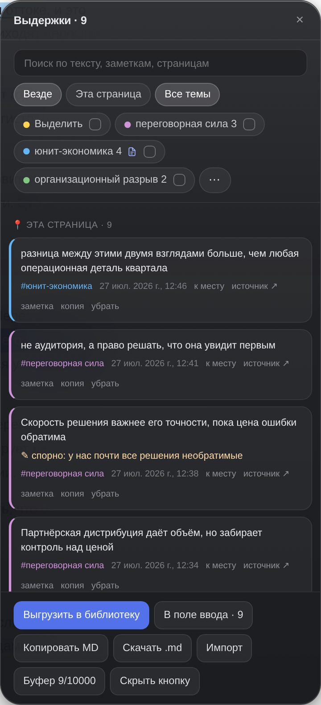
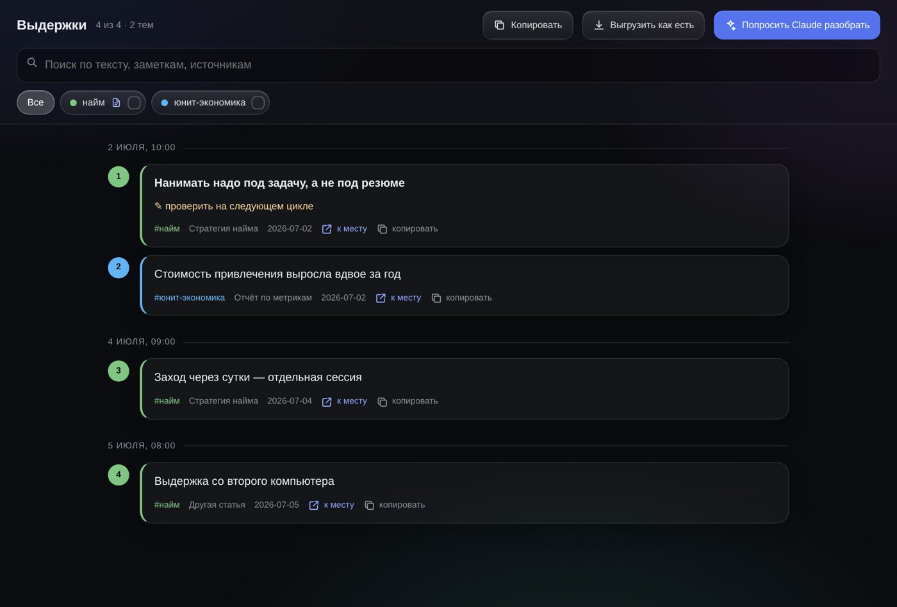
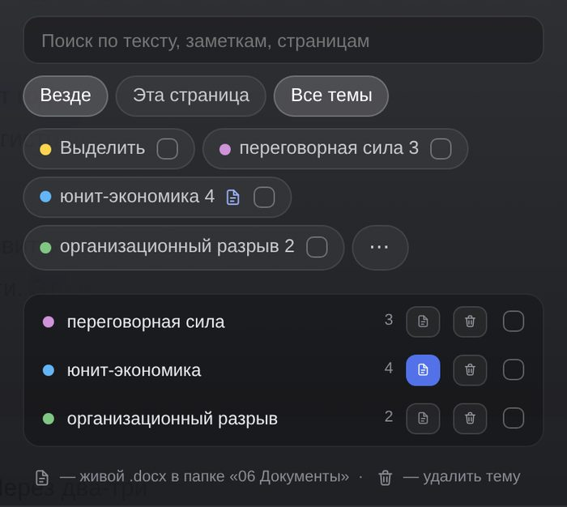

# Chat Marker

Маркер для браузера. Выделяешь важное прямо в чате с ИИ или в статье — оно остаётся выделенным, когда вернёшься на страницу, складывается по темам и превращается в личную библиотеку, к которой можно потом обращаться словами.

Обычные закладки сохраняют страницу целиком. Здесь сохраняется конкретная мысль — с заметкой, темой и ссылкой ровно на то место, где она была сказана.



## Что оно вообще делает

Выделяешь текст мышкой — всплывает панель с цветами. Выбрал цвет, при желании дописал заметку и тему. Всё, дальше можно читать дальше.

Выделение живёт на странице: закрыл вкладку, вернулся через неделю — оно на месте. Работает где угодно: claude.ai, ChatGPT, Хабр, документация, новости, любой сайт с текстом.

Сбоку живёт панель со всем, что накопилось: поиск, фильтры по темам, переход к любому выделению одним кликом.



Дальше по желанию — три уровня, каждый следующий необязателен.

## Уровень 1. Только браузер

Пять минут, терминал не нужен вообще. Получаешь маркер и просмотрщик выдержек.

**Шаг 1. Поставь Tampermonkey** — расширение, через которое браузер умеет запускать пользовательские скрипты. [tampermonkey.net](https://www.tampermonkey.net) → кнопка Chrome → Install → Добавить расширение.

**Шаг 2. Разреши ему запускать скрипты.** Это отдельный шаг, без него ничего не заработает и Chrome даже не объяснит, почему.

Правый клик по иконке Tampermonkey → «Управление расширением» → включи **«Разрешить пользовательские скрипты»** (Allow User Scripts).

Если такого переключателя нет — у тебя Chrome постарее. Тогда: `chrome://extensions` → правый верхний угол → **«Режим разработчика»**.

**Шаг 3. Поставь сам скрипт** — открой [эту ссылку](https://raw.githubusercontent.com/abdurahhiimov/chat-marker/main/chat-marker.user.js), Tampermonkey перехватит её сам и покажет кнопку «Install». Нажми.

**Шаг 4.** Открой любую статью, перезагрузи страницу (Cmd+R). Внизу справа появится круглая кнопка. Выдели текст — увидишь панель с цветами.

**Шаг 5, для просмотра выдержек.** Скачай [Просмотр выдержек.html](https://raw.githubusercontent.com/abdurahhiimov/chat-marker/main/Просмотр%20выдержек.html) (правый клик → «Сохранить ссылку как»). Открой файл двойным кликом и перетащи внутрь `highlights.json` из «Загрузок» — тот, что скачивает панель маркера кнопкой «Скачать .json».



Поиск, фильтры по темам, переход к месту в оригинале, выгрузка конспекта в markdown. Файл автономный: интернет ему не нужен, данные никуда не отправляются, всё считается прямо в браузере.

Этого хватает надолго. Дальше — если захочется, чтобы всё складывалось само.

## Уровень 2. Библиотека, которая собирается сама

Одна команда в терминале. Питон, Google Drive, программирование — ничего заранее не нужно, установщик разберётся сам.

Открой Терминал (Cmd+Space, набери «Терминал»), вставь и нажми Enter:

```bash
curl -fsSL https://raw.githubusercontent.com/abdurahhiimov/chat-marker/main/install.sh | bash
```

Пароль администратора не спросит. В систему ничего не лезет: всё живёт в двух папках, обе удаляются одной командой.

Если питона на маке нет — установщик скачает свой, отдельный, только для себя. Если нет Google Drive — сложит библиотеку в «Документы» и скажет об этом.

Что получится: папка, куда выгрузки приезжают сами и раскладываются по темам, по страницам и по датам. Плюс индекс, таблица и тот же дашборд, но уже собранный автоматически.

```
AI Highlights/
├── 00 Inbox/         сырьё
├── 01 Темы/          найм.md, юнит-экономика.md
├── 02 Страницы/      по источникам
├── 04 Черновики/     твоя территория, скрипт сюда не лезет
├── 06 Документы/     живой .docx по отмеченным темам
├── Индекс.md         начинать отсюда
├── Выдержки.xlsx
└── Дашборд.html
```

Выгрузки **сливаются**, а не перезаписываются: можно выгружать с двух компьютеров, ничего не потеряется. Удалённое в браузере удаляется и в библиотеке, а вытесненное из буфера браузера — остаётся, библиотека и есть архив.

## Уровень 3. Спрашивать словами

Если стоит Claude Desktop, установщик подключит к нему библиотеку сам. После этого можно не искать руками:

> что у меня накопилось по теме найма

> собери все зелёные выдержки про юнит-экономику в конспект

> покажи красное — там то, к чему я хотел вернуться

Claude лезет в библиотеку сам, ищет по темам, цветам, источникам и датам. После установки перезапусти Claude Desktop через **Cmd+Q** — просто закрыть окно мало.

## Захват вне браузера: PDF, Word, «Просмотр»

У второго уровня есть важное дополнение — [Hammerspoon](https://www.hammerspoon.org). Без него выделять можно только на веб-страницах, а PDF в браузере не выделяется вообще: Chrome рисует его без текстового слоя. Рабочие документы — это как раз PDF и Word, поэтому эта часть закрывает половину реальных сценариев.

Поставь Hammerspoon (Download → перетащить в Программы), запусти `bash ~/.chatmarker/update.sh` — конфиг допишется сам. Дальше в любом приложении: выделил текст → `⌃⌥⌘1…4` → выдержка в библиотеке, с пометкой из какого приложения и окна.

| Хоткей | Что делает |
|---|---|
| `⌃⌥⌘1` | формулировка (жёлтый) |
| `⌃⌥⌘2` | идея (зелёный) |
| `⌃⌥⌘3` | факт или метод (синий) |
| `⌃⌥⌘4` | спорно, вернуться (красный) |
| `⌃⌥⌘N` | захватить и сразу написать заметку с темой |
| `⌃⌥⌘O` | открыть папку библиотеки |

Из «Просмотра» выдержка запоминает ещё и номер страницы PDF — ссылка «к месту» в дашборде откроет документ ровно на ней.

Почему три клавиши, а не Alt+цифра: Alt+1…4 уже заняты браузерным маркером. Сократишь — сломается браузерная часть, причём молча.

При первом запуске Hammerspoon сам попросит «Универсальный доступ» — без него хоткеи молчат, это нормально, дай разрешение один раз.

## Как этим живут

Отмечаешь по ходу чтения, не отвлекаясь. Раз в несколько дней жмёшь в панели «Скачать .json» — рядом висит счётчик, сколько ещё не уехало. Дальше либо кидаешь файл в просмотрщик, либо (на втором уровне) он уезжает в библиотеку сам.

Выгрузка должна попадать в саму папку «Загрузки» или в подпапку первого уровня (например, `Загрузки/Выдержки`) — глубже автоматика не смотрит. Мгновенное срабатывание фонового агента работает только для корня «Загрузок»; из подпапок файлы подхватываются при ближайшей сборке или запросе к Claude.

Горячие клавиши: `Alt+1…4` — цвет не отрывая рук от клавиатуры, `Alt+H` — боковая панель.

Темы: пишешь заметку с решёткой — «это надо проверить #найм» — и выдержка попадает в тему. В панели темы становятся фильтрами, а под полем заметки висят уже существующие, чтобы не вспоминать формулировку.



## Куда уходят данные

Никуда. Выделения лежат в хранилище расширения у тебя в браузере, выгрузка падает в «Загрузки», библиотека — папка на диске (или в твоём собственном Google Drive, если он есть). Сервера у этой штуки нет, аккаунта нет, регистрации нет.

Google Drive используется как обычная синхронизированная папка — ни OAuth, ни ключей, ни доступа к аккаунту со стороны.

## Если что-то не работает

**Кнопка не появилась.** Не перезагружена вкладка после установки скрипта. Если и после Cmd+R пусто — скорее всего не включён «Разрешить пользовательские скрипты» (шаг 2).

**Выделение пропало после перезагрузки страницы.** Текст на странице изменился — на сайтах с динамикой это бывает. Выдержка не потеряна, она в панели и в выгрузке, просто подсветить её на новом тексте не вышло.

**Claude не видит библиотеку.** Не перезапущен через Cmd+Q. Проверить, что сервер прописан: `cat "$HOME/Library/Application Support/Claude/claude_desktop_config.json"`

**Библиотека не обновляется.** Запусти сборку руками и посмотри на ошибку: `~/.chatmarker/venv/bin/python ~/.chatmarker/library.py`

**Что-то ещё.** `bash ~/.chatmarker/diagnose-agent.sh` — покажет, что стоит, что нет и где сломалось.

## Обновить и удалить

```bash
bash ~/.chatmarker/update.sh      # обновиться до свежей версии
bash ~/.chatmarker/uninstall.sh   # удалить всё служебное
```

Удаление не трогает ни библиотеку выдержек, ни папку «Документы/Chat Marker». Скрипт в Tampermonkey убирается руками, через панель расширения.

## Что внутри

| | |
|---|---|
| `chat-marker.user.js` | сам маркер, скрипт для Tampermonkey |
| `Просмотр выдержек.html` | автономный просмотрщик, работает без всего |
| `install.sh` | установщик второго и третьего уровня |
| `scripts/library.py` | сборщик библиотеки |
| `scripts/highlights_mcp.py` | мост к Claude Desktop |
| `docs/Chat Marker — мануал.html` | подробный мануал со скриншотами |
| `extras/chatmarker.skill` | скилл для Claude — контекст проекта, если будешь его дорабатывать |

Подробная инструкция для тех, кто терминал видел пару раз — [УСТАНОВКА.md](УСТАНОВКА.md).

## Требования

macOS для второго и третьего уровня. Первый уровень — любая система, любой браузер на движке Chromium с Tampermonkey: Chrome, Arc, Edge, Brave, Vivaldi. Про Safari — [docs/Safari.md](docs/Safari.md).

## Лицензия

MIT. Делай что хочешь.
