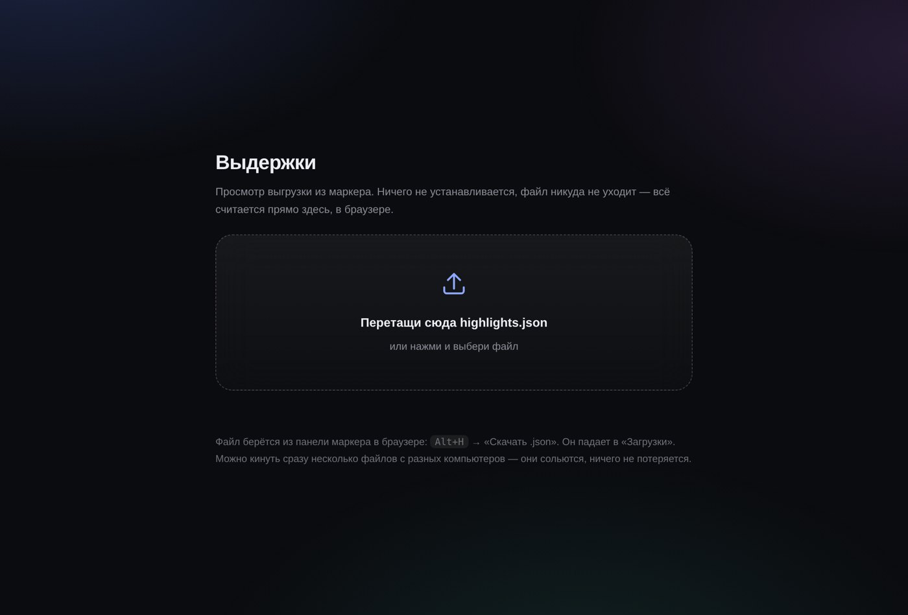

# Установка по шагам

Для того, кто терминал видел два раза в жизни. Ничего сломать здесь нельзя: всё, что ставится, удаляется одной командой, и системных папок оно не касается.

Читай сверху вниз, останавливайся где надоест — каждая часть работает сама по себе.

---

## Часть 1. Маркер в браузере

Пять минут. Терминал не нужен.

### 1.1. Tampermonkey

Chrome сам по себе не умеет запускать чужие скрипты — для этого нужен посредник. Tampermonkey и есть посредник, им пользуются миллионы людей уже лет пятнадцать.

1. Открой https://www.tampermonkey.net
2. Нажми большую кнопку **Chrome**
3. Откроется магазин расширений → **«Установить»** → **«Добавить расширение»**

В правом верхнем углу браузера появится чёрно-серая иконка. Если её не видно — нажми на кусочек пазла рядом с адресной строкой и приколи Tampermonkey булавкой.

### 1.2. Разрешить запуск скриптов

**Самый важный шаг. Пропустишь — дальше ничего не заработает, и браузер никак не подскажет почему.**

Google требует, чтобы разрешение на запуск скриптов человек включал отдельно, руками.

**Если Chrome свежий (138 и новее):**

1. Правый клик по иконке Tampermonkey
2. **«Управление расширением»** (Manage extension)
3. Найди переключатель **«Разрешить пользовательские скрипты»** (Allow User Scripts) и включи

**Если такого переключателя нет:**

1. Скопируй в адресную строку: `chrome://extensions`
2. Правый верхний угол — переключатель **«Режим разработчика»** (Developer mode)
3. Включи

Chrome иногда потом показывает предупреждение «отключите режим разработчика». Не отключай — просто закрой предупреждение.

### 1.3. Сам маркер

Открой эту ссылку:

**https://raw.githubusercontent.com/abdurahhiimov/chat-marker/main/chat-marker.user.js**

Tampermonkey поймает её и покажет страницу установки с кнопкой **«Install»** (или «Установить»). Нажми.

Если вместо этого открылась страница с кодом — Tampermonkey не поймал ссылку. Тогда: иконка Tampermonkey → **«Панель управления»** → вкладка **«Утилиты»** → внизу поле **«Импорт из URL»** → вставь ту же ссылку → **Install**.

### 1.4. Проверка

1. Открой любую статью — Википедию, Хабр, чат с Claude
2. Перезагрузи страницу: **Cmd+R**
3. Внизу справа должна появиться круглая кнопка со счётчиком
4. Выдели любой кусок текста мышкой — всплывёт панель с цветами

Нажми на цвет. Текст останется выделенным. Перезагрузи страницу — выделение на месте.

Не появилось? Вернись к шагу 1.2, дело почти всегда в нём.

### 1.5. Как пользоваться

| | |
|---|---|
| выделить мышкой | всплывает панель |
| `Alt+1` … `Alt+4` | цвет сразу, без панели |
| `Alt+H` | боковая панель со всем накопленным |
| нажать на выделение | заметка, тема, снять |

Тема пишется в заметке через решётку: «надо проверить #найм». Одна выдержка может попасть в несколько тем.

---

## Часть 2. Просмотрщик выдержек

Тоже без терминала. Нужен, чтобы посмотреть всё накопленное разом: с поиском, фильтрами и переходом к оригиналу.

### 2.1. Скачать файл

Открой ссылку → правый клик на странице → **«Сохранить как»** → положи, например, в «Документы»:

**https://raw.githubusercontent.com/abdurahhiimov/chat-marker/main/Просмотр%20выдержек.html**

Один файл, 30 килобайт, внутри всё нужное.

### 2.2. Выгрузить накопленное

В браузере: `Alt+H` → внизу панели кнопка **«Скачать .json»**. Файл `highlights.json` упадёт в «Загрузки».

### 2.3. Посмотреть

Двойной клик по `Просмотр выдержек.html` → откроется в браузере → перетащи в рамку `highlights.json` из «Загрузок».



Всё. Поиск сверху, темы кнопками, «к месту» открывает оригинал ровно на нужном абзаце.

Файл ничего никуда не отправляет — он вообще не умеет работать с сетью, вся обработка идёт внутри браузера. Можно спокойно пересылать друзьям.

Есть выгрузки с двух компьютеров? Кинь оба файла разом, они сольются.

---

## Часть 3. Библиотека, которая собирается сама

Здесь понадобится терминал, но ровно на одну команду.

Что появится: папка, куда выгрузки приезжают сами и раскладываются по темам, страницам и датам. Плюс индекс, таблица для Google Sheets и дашборд.

### 3.1. Одна команда

1. Нажми **Cmd+Space**, набери «Терминал», Enter
2. Скопируй строку целиком и вставь (**Cmd+V**), нажми Enter:

```bash
curl -fsSL https://raw.githubusercontent.com/abdurahhiimov/chat-marker/main/install.sh | bash
```

3. Жди. Минута-две, иногда чуть больше, если качается питон.

Пароль не спросит. Установщик рассказывает, что делает, на каждом шаге.

### 3.2. Что происходит внутри

**Питон.** Если он на маке уже есть и достаточно свежий — используется он. Если нет — скачивается свой, в папку `~/.chatmarker`, ни на что в системе не влияет и удаляется вместе с ней. Ставить его отдельно не надо.

**Google Drive.** Если стоит — библиотека ляжет туда, и будет доступна с телефона и с других компьютеров. Если нет — ляжет в «Документы», и это тоже нормально. Поставишь Drive потом — просто запусти установку ещё раз, библиотека переедет.

**Claude Desktop.** Если стоит — подключится (см. часть 4). Если нет — этот шаг просто пропустится.

**Папка «Документы/Chat Marker».** Туда кладутся просмотрщик, мануал и сам скрипт, чтобы не искать. В конце она откроется сама.

### 3.3. Как это работает дальше

Выделяешь в браузере как обычно. Раз в несколько дней жмёшь «Скачать .json» — или ничего не жмёшь, скрипт сам выгружает раз в десять минут, если есть что.

Файл падает в «Загрузки», фоновый агент его подхватывает, переносит в библиотеку, делает бэкап предыдущей версии и пересобирает всё заново. Секунд пять.

Начинать смотреть — с файла `Индекс.md`. Дашборд — `Дашборд.html`, двойной клик.

### 3.4. Доступ к «Загрузкам» (по желанию)

macOS не пускает фоновые программы в «Загрузки» без явного разрешения. Без него всё работает, просто сборка случится не сразу, а в момент, когда ты о чём-нибудь спросишь Claude.

Хочешь мгновенно:

**Системные настройки** → **Конфиденциальность и безопасность** → **Полный доступ к диску** → **«+»** → **Cmd+Shift+G** → впиши `~/Applications` → выбери **ChatMarker Sync**.

---

## Часть 4. Спрашивать словами

Нужен Claude Desktop — https://claude.ai/download. Если он был установлен до части 3, всё уже подключено.

### 4.1. Перезапустить

**Cmd+Q**, потом открыть заново. Именно Cmd+Q: закрыть окно крестиком недостаточно, программа остаётся в памяти со старыми настройками.

### 4.2. Проверить

Спроси у Claude:

> покажи статистику по моим выдержкам

Должен ответить цифрами — сколько выдержек, сколько тем, откуда. Если говорит, что не видит инструментов — не перезапущен через Cmd+Q.

### 4.3. Что можно спрашивать

> что у меня накопилось по теме найма

> собери конспект по юнит-экономике из зелёных выдержек

> покажи красное за последнюю неделю

> из каких статей я больше всего выписывал

Если Claude Desktop поставлен позже, чем прошла установка — просто запусти команду из 3.1 ещё раз.

---

## Если что-то пошло не так

**«command not found: curl»** — маловероятно, curl есть в macOS искаробки. Проверь, что скопировал строку целиком, вместе с `curl` в начале.

**Установка ругается на интернет.** Скорее всего VPN или корпоративный прокси. Выключи VPN и попробуй ещё раз.

**Кнопка маркера не появляется.** Часть 1, шаг 1.2. Это причина в девяти случаях из десяти.

**Claude не видит выдержки.** Cmd+Q и открыть заново.

**Хочу посмотреть, что вообще стоит:**

```bash
bash ~/.chatmarker/diagnose-agent.sh
```

Покажет, что установлено, где библиотека, работает ли агент и что в логе.

**Хочу всё удалить:**

```bash
bash ~/.chatmarker/uninstall.sh
```

Выдержки и библиотека останутся — сносится только служебное. Скрипт из Tampermonkey убирается руками: иконка → «Панель управления» → корзина.

---

## Куда уходят данные

Никуда. Сервера нет, аккаунта нет, регистрации нет, ничего никуда не отправляется.

Выделения лежат в хранилище расширения внутри твоего браузера. Выгрузка падает в «Загрузки». Библиотека — обычная папка на диске. Google Drive, если он есть, используется просто как синхронизированная папка: ни ключей, ни доступа к аккаунту со стороны.
